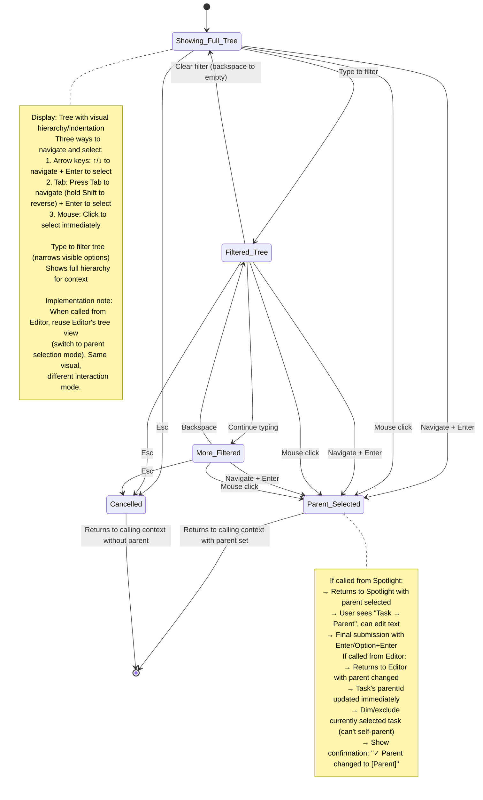
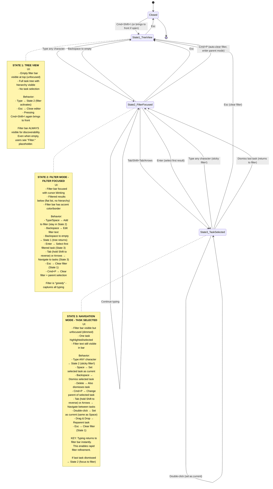
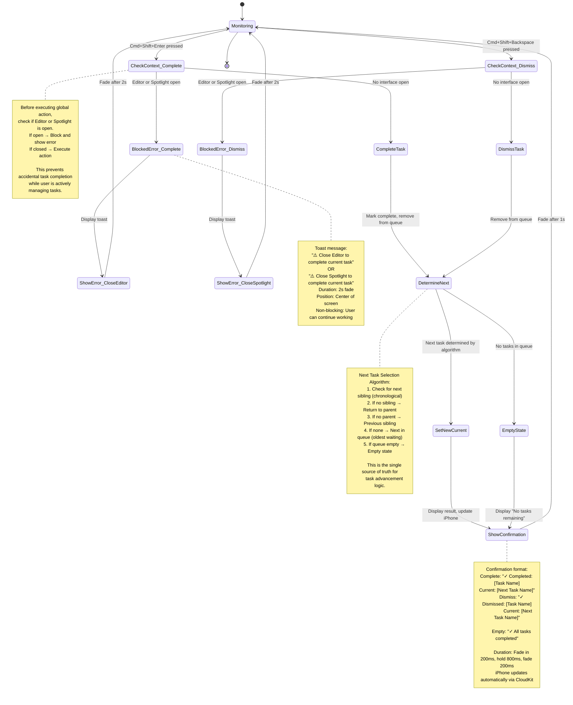
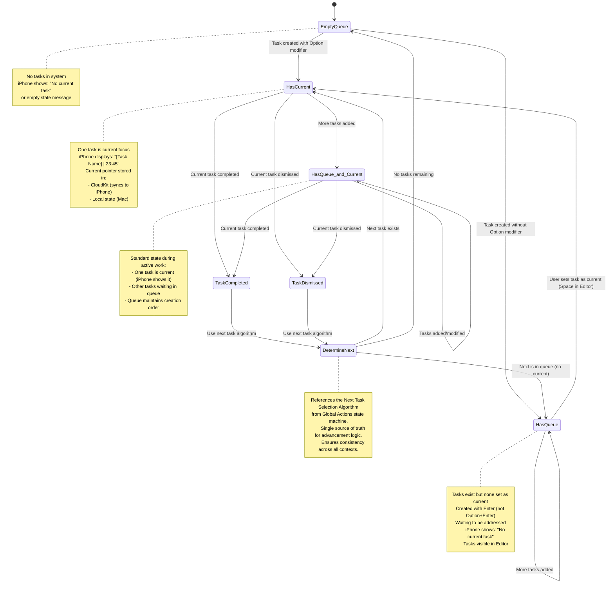
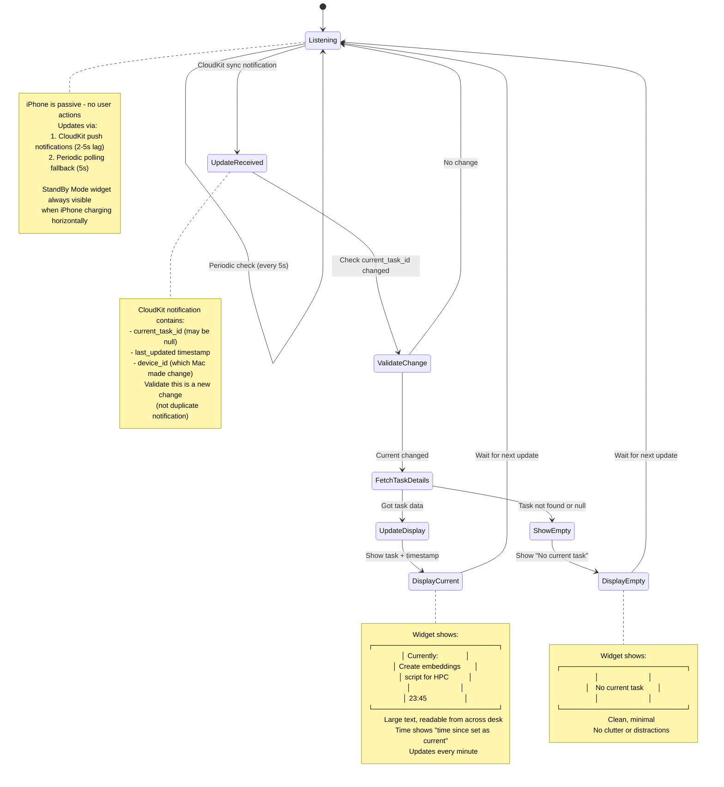

# Hold - State Diagrams (Final Implementation)

**Version:** 1.0 Final  
**Last Updated:** November 8, 2025

Complete state machine specifications with all decisions locked in. Ready for implementation.

---

## Implementation Priority

Build in this order:
1. **Spotlight (State Machine #1)** - Core capture interface
2. **Task Queue (State Machine #5)** - Current task tracking
3. **Global Actions (State Machine #4)** - Complete/dismiss with blocking
4. **Editor (State Machine #3)** - Management with filter
5. **Parent Selector (State Machine #2)** - Advanced hierarchy
6. **iPhone Display (State Machine #6)** - Passive sync

---

## 1. Spotlight (Entry Bar) State Machine

Primary task capture interface. Opens with `Cmd+Shift+Space`.

```mermaid
stateDiagram-v2
    [*] --> Closed
    
    Closed --> Open_Blank: Cmd+Shift+Space (or brings to front if open)
    
    Open_Blank --> Open_Prefilled_Current: Up Arrow
    Open_Blank --> ParentSelector: Type + Cmd+P
    Open_Blank --> Closed: Esc
    Open_Blank --> TaskCreated_TopLevel: Type + Enter
    Open_Blank --> TaskCreated_TopLevel_Switch: Type + Option+Enter
    Open_Blank --> TaskCreated_Child: Type + Shift+Enter (if current exists)
    Open_Blank --> Error_NoCurrentForChild: Shift+Enter (no current)
    Open_Blank --> TaskCreated_Sibling: Type + Cmd+Enter (if current exists)
    Open_Blank --> Error_NoCurrentForSibling: Cmd+Enter (no current)
    Open_Blank --> TaskCreated_Sibling_Switch: Type + Cmd+Option+Enter (if current exists)
    
    Open_Prefilled_Current --> Open_Prefilled_Current: Up Arrow (idempotent, do nothing)
    Open_Prefilled_Current --> Open_Blank: Down Arrow
    Open_Prefilled_Current --> Closed: Esc (no save)
    Open_Prefilled_Current --> TaskUpdated: Edit + Enter
    
    Open_Blank --> Open_Blank: Down Arrow (idempotent, do nothing)
    
    ParentSelector --> Open_With_Parent_Selected: Select parent + Enter
    ParentSelector --> Open_Blank: Esc (cancel parent selection)
    
    Open_With_Parent_Selected --> ParentSelector: Cmd+P (change parent)
    Open_With_Parent_Selected --> Open_Blank: Clear parent selection
    Open_With_Parent_Selected --> Closed: Esc
    Open_With_Parent_Selected --> TaskCreated_WithParent: Enter
    Open_With_Parent_Selected --> TaskCreated_WithParent_Switch: Option+Enter
    
    Error_NoCurrentForChild --> ShowError_Child: Display toast
    Error_NoCurrentForSibling --> ShowError_Sibling: Display toast
    
    ShowError_Child --> Open_Blank: Fade after 2s
    ShowError_Sibling --> Open_Blank: Fade after 2s
    
    TaskCreated_TopLevel --> ShowConfirmation_TopLevel: Display "✓ Task created"
    TaskCreated_TopLevel_Switch --> ShowConfirmation_TopLevel_Switch: Display "✓ Task created (current)"
    TaskCreated_Child --> ShowConfirmation_Child: Display "✓ Child created under [Current] (current)"
    TaskCreated_Sibling --> ShowConfirmation_Sibling: Display "✓ Sibling created"
    TaskCreated_Sibling_Switch --> ShowConfirmation_Sibling_Switch: Display "✓ Sibling created (current)"
    TaskCreated_WithParent --> ShowConfirmation_WithParent: Display "✓ Task created under [Parent]"
    TaskCreated_WithParent_Switch --> ShowConfirmation_WithParent_Switch: Display "✓ Task created under [Parent] (current)"
    TaskUpdated --> ShowConfirmation_Updated: Display "✓ Task updated"
    
    ShowConfirmation_TopLevel --> Closed: Fade after 1s
    ShowConfirmation_TopLevel_Switch --> Closed: Fade after 1s, iPhone updates
    ShowConfirmation_Child --> Closed: Fade after 1s, iPhone updates
    ShowConfirmation_Sibling --> Closed: Fade after 1s
    ShowConfirmation_Sibling_Switch --> Closed: Fade after 1s, iPhone updates
    ShowConfirmation_WithParent --> Closed: Fade after 1s
    ShowConfirmation_WithParent_Switch --> Closed: Fade after 1s, iPhone updates
    ShowConfirmation_Updated --> Closed: Fade after 1s, iPhone updates if current
    
    Closed --> [*]
    
    note right of Open_Blank
        Primary capture interface
        
        Up Arrow = load current task for editing (idempotent)
        Down Arrow = clear text (idempotent)
        Tab = does nothing (reserved)
        
        Cmd+P = select parent (two-step flow)
        Shift+Enter = create child of current (error if no current)
        Cmd+Enter = create sibling of current (error if no current)
        Cmd+Option+Enter = create sibling and switch
        
        Pressing Cmd+Shift+Space again brings window to front
        (doesn't close, Esc is for closing)
    end note
    
    note right of Error_NoCurrentForChild
        Toast message:
        "⚠️ No parent task. Create a top-level task first."
        
        Duration: 2s fade
        User can still type/interact
        Error doesn't close Spotlight
    end note
    
    note right of Error_NoCurrentForSibling
        Toast message:
        "⚠️ No reference task. Create a task first."
        
        Duration: 2s fade
        User can still type/interact
        Error doesn't close Spotlight
    end note
    
    note right of ParentSelector
        Opens as picker overlay (State Machine #2)
        Navigate: ↑/↓ or Tab (hold Shift to reverse), type to filter
        Enter = select parent and return to Spotlight
        Esc = cancel, return to Spotlight
        Click = select immediately
    end note
    
    note right of Open_With_Parent_Selected
        Returns to Spotlight with parent selected
        Shows: "Task name → Parent Name"
        Can edit text or change parent
        Final submission: Enter or Option+Enter
    end note
```



---

## 2. Parent Selector State Machine

Opened from Spotlight (`Cmd+P`) or Editor (`Cmd+P`). Full task hierarchy tree for parent selection.



---

## 3. Editor State Machine

Full task management interface. Opens with `Cmd+Shift+\`.

**Three Modes:**
1. **Tree View** (State 1) - Full hierarchy, empty filter bar visible
2. **Filter Mode** (State 2) - Filter bar focused, flat results
3. **Navigation Mode** (State 3) - Task selected, filter visible but unfocused



**Filter Persistence:**
- Filter text persists when Editor closes
- Next open shows previous filter active
- Allows work continuation across sessions

---

## 4. Global Actions State Machine

Global shortcuts that work anywhere: Complete and Dismiss current task.



---

## 5. Task Queue State Machine

Manages current task pointer and chronological queue.



---

## 6. iPhone Display State Machine

Passive display only. No user interaction.



---

## State Transition Specifications

### Task Creation Modifiers

| Shortcut | Creates | Switches? | iPhone Update? |
|----------|---------|-----------|----------------|
| `Enter` | Top-level | No | No |
| `Option+Enter` | Top-level | Yes | Yes ✓ |
| `Shift+Enter` | Child | Yes | Yes ✓ |
| `Cmd+Enter` | Sibling | No | No |
| `Cmd+Option+Enter` | Sibling | Yes | Yes ✓ |

**Rule:** iPhone only updates when task becomes current (Option modifier or Shift for child).

### Confirmation Messages

Every user action shows brief toast confirmation:

**Success messages:**
- "✓ Task created"
- "✓ Task created (current)" ← iPhone updates
- "✓ Child created under [Parent] (current)"
- "✓ Sibling created"
- "✓ Sibling created (current)"
- "✓ Task created under [Parent]"
- "✓ Task updated"
- "✓ Task completed"
- "✓ Task dismissed"
- "✓ Parent changed to [Parent]"

**Error messages:**
- "⚠️ No parent task. Create a top-level task first."
- "⚠️ No reference task. Create a task first."
- "⚠️ Close Editor to complete current task"
- "⚠️ Close Spotlight to complete current task"
- "⚠️ Cannot delete task with children"
- "⚠️ Task name required"

**Format:**
- Position: Below action point (Spotlight) or center screen (global)
- Animation: Fade in 200ms, hold 800ms, fade out 200ms
- Style: White background, rounded corners, subtle shadow
- Icon: ✓ for success, ⚠️ for warnings/errors

### Next Task Selection Algorithm

**Single source of truth for task advancement:**

```
When current task is completed or dismissed:

1. Check for next sibling (chronological order)
   → If exists, make it current
   
2. If no next sibling, check for parent
   → Return focus to parent task
   
3. If no parent, check for previous sibling
   → Move back to previous sibling
   
4. If none of above, get next from queue
   → Chronological order (oldest waiting task)
   
5. If queue is empty
   → Empty state (no current task)
```

**Edge cases:**
- Dismissing a parent with children → Blocked (error shown)
- Completing last task in nested structure → Returns up tree
- Queue empty but tree has tasks → Shows empty (manual selection needed)

### Orphaned Tasks (v2)

**MVP behavior:** Block deletion of parent with children
- User must delete/dismiss children first
- Error: "⚠️ Cannot delete task with children"
- Prevents orphans from existing

**v2 consideration:** May add "cascade delete" or "promote to parent's level" options

---

## Implementation Testing Checklist

### State Machine #1: Spotlight
- [ ] Open with Cmd+Shift+Space
- [ ] Type and create with each Enter variation
- [ ] Test Up/Down arrows (idempotent behavior)
- [ ] Test Cmd+P parent selection flow
- [ ] Verify error messages for no current task
- [ ] Test Esc closes without creating

### State Machine #2: Parent Selector
- [ ] Open from Spotlight (Cmd+P)
- [ ] Navigate with arrows, Tab, and mouse
- [ ] Filter tree with typing
- [ ] Select parent and return to Spotlight
- [ ] Test from Editor context (reparenting)

### State Machine #3: Editor
- [ ] Open with Cmd+Shift+\
- [ ] Type to enter filter mode (State 1 → 2)
- [ ] Navigate filtered results (State 2 → 3)
- [ ] Type while task selected (State 3 → 2, sticky!)
- [ ] Test Space to set current
- [ ] Test Backspace to dismiss (context-sensitive)
- [ ] Test filter persistence across reopens
- [ ] Verify filter bar always visible

### State Machine #4: Global Actions
- [ ] Complete task with Cmd+Shift+Enter
- [ ] Dismiss task with Cmd+Shift+Backspace
- [ ] Test blocking when Editor open
- [ ] Test blocking when Spotlight open
- [ ] Verify next task selection algorithm
- [ ] Check confirmation messages display

### State Machine #5: Task Queue
- [ ] Create tasks with/without Option
- [ ] Verify queue order maintained
- [ ] Complete task and check advancement
- [ ] Test empty state reached correctly
- [ ] Verify current pointer syncs

### State Machine #6: iPhone Display
- [ ] Set task on Mac, verify iPhone updates
- [ ] Test 2-5s sync lag acceptable
- [ ] Complete task, verify iPhone shows next
- [ ] Reach empty state, verify iPhone shows "No current task"
- [ ] Test StandBy Mode display

---

## Edge Cases Handled

### In This Implementation
✅ **Up/Down idempotent** - Pressing twice does nothing  
✅ **No current task errors** - Clear guidance to user  
✅ **Global actions blocked** - Prevents accidents when managing tasks  
✅ **Backspace context-sensitive** - Edits filter OR dismisses task  
✅ **Sticky filter** - Typing returns to filter bar  
✅ **Filter persistence** - Remembers last filter  
✅ **Empty queue** - Graceful empty state  
✅ **Parent deletion blocked** - Can't orphan children  

### Deferred to v2
⏸️ **Undo/redo** - Full action history  
⏸️ **Multi-device sync** - Beyond Mac + iPhone  
⏸️ **Conflict resolution** - Two devices edit simultaneously  
⏸️ **Task editing** - Inline edit in Editor  
⏸️ **Right-click menus** - Context menu actions  
⏸️ **Orphan handling** - Alternative to blocking deletion  
⏸️ **Performance at scale** - Tested up to 100 tasks in MVP  

---

## Summary

These six state machines define the complete behavior of Hold:

1. **Spotlight** - Fast task capture with hierarchical creation
2. **Parent Selector** - Visual tree picker for parent selection
3. **Editor** - Three-mode interface for management and filtering
4. **Global Actions** - Complete/dismiss with context-aware blocking
5. **Task Queue** - Current task tracking and advancement
6. **iPhone Display** - Passive sync and display

**All decisions locked.** Ready for UI design phase.

**Key innovations:**
- Sticky filter bar (typing always returns to filter)
- Context-sensitive Backspace (edits OR dismisses)
- Idempotent Up/Down (no accidental triggers)
- Global action blocking (prevents accidents)
- Filter persistence (work continuation)

**Philosophy maintained:**
- Minimal complexity
- Keyboard-first
- Cognitive relief
- Apple-like polish

This is the complete specification. Build it exactly as documented.